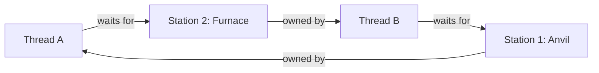

# ARSW Lab 3 - Relic Rush - Delivery Report

## Team

| Student | ID | GitHub |
|---|---|---|
| Juan Sebastian Murcia | 1000095196 | JuanMurciaY |
| `[STUDENT 2]` | `[ID]` | `[GITHUB]` |
| Jhonatan Madero | `[ID]` | `[GITHUB]` |

Repository: `https://github.com/jhonatanpenamora-png/Lab03_ARSW`

Final commit: `[FINAL SHA - COMPLETE AFTER THE LAST MERGE]`

## 1. Baseline observations

Commands executed with the unmodified starter:

```text
mvn clean test
mvn -q -DskipTests package
java -cp target/classes edu.eci.arsw.relicrush.app.LedgerRaceProbe 64 5000
java -cp target/classes edu.eci.arsw.relicrush.app.DeadlockProbe
```

The original Maven test passed because the starter only contained a Java-version
smoke test. The isolated ledger probe reproduced lost counter updates and
concurrent corruption/loss in the `ArrayList`:

```text
expected=320000 totalCrafted=7779 eventCount=255137 invariant=BROKEN
```

The exact damaged values vary between executions, but they remained below the
expected 320000. The deadlock probe produced a two-thread wait cycle:

```text
DEADLOCK DETECTED
- probe-A-anvil-then-furnace waiting on ForgeStation@... owned by probe-B-furnace-then-anvil
- probe-B-furnace-then-anvil waiting on ForgeStation@... owned by probe-A-anvil-then-furnace
```

Therefore, the starter did not preserve the ledger invariant and could stop
making progress.

## 2. Coordination analysis

### `roundStart`

`roundStart` is a reusable start gate with `adventurers + 1` parties: every
worker waits for the coordinator, and the coordinator waits until all workers
are ready. It creates a clear boundary between rounds and prevents a player from
starting the next turn early.

### `roundEnd`

`roundEnd` is the completion gate. The coordinator cannot read the scoreboard
until every adventurer has completed `playTurn` for the current round. It keeps
events and scores from different rounds out of the same snapshot.

`Thread.sleep(...)` is not a replacement for either barrier. A sleep expresses
elapsed time, not readiness or completion; its correctness would depend on CPU
load and scheduling and it does not count participants. A successful barrier
crossing also provides a memory-consistency relationship: actions performed by
workers before `roundEnd.await()` are visible to the coordinator after its
corresponding `await()` returns. This is why the non-volatile per-player score
can be safely read at the round snapshot.

## 3. Thread-safety problems

| Shared state | Problem | Invariant at risk | Solution | Why this solution? |
|---|---|---|---|---|
| `ForgeLedger.totalCrafted` | `total + 1` followed by assignment was a non-atomic read-modify-write | Crafted relics could be lost from the total | `AtomicInteger.incrementAndGet()` | Atomic update without a game-wide monitor |
| `ForgeLedger.events` | `ArrayList` does not support concurrent writes | Events could be lost or internal state corrupted | `ConcurrentLinkedQueue<ForgeEvent>` | Safe, non-blocking concurrent writes and stable copy after the round barrier |
| `Adventurer.score` | Not volatile and read by coordinator | Snapshot visibility | Single-writer ownership plus `roundEnd` | No extra lock is needed because the barrier publishes completed writes |

`record` first validates/adds the event and then increments the atomic counter.
The coordinator never uses a mid-record observation as a round result: it reads
only after every worker completes `roundEnd`. Consequently, at each completed
round every completed `record` contributes one event and one counter increment.
Synchronizing the complete game would be unnecessary and would serialize craft
operations using unrelated stations.

One trade-off is that `ConcurrentLinkedQueue.size()` is linear in the number of
events. It is called only once per round for diagnostics, so this cost is
acceptable for the laboratory. A separate event counter could improve very
large monitoring workloads but would add another value to keep consistent.

## 4. Deadlock diagnosis

### 4.1 Evidence

Before the fix, thread A held the anvil monitor and waited for the furnace while
thread B held the furnace and waited for the anvil. Neither could reach the
inner action or release its first monitor.

### 4.2 Coffman conditions in Relic Rush

- **Mutual exclusion:** a `ForgeStation` Java monitor can be owned by only one
  thread at a time.
- **Hold and wait:** the outer `synchronized` retained the first station while
  the thread attempted to enter the second monitor.
- **No preemption:** a Java monitor is released by its owner when leaving its
  synchronized region; another player cannot take it away.
- **Circular wait:** opposite requested orders created `A -> furnace -> B ->
  anvil -> A`.

### 4.3 Wait-for graph



### 4.4 Fix

`LockPair.withBoth` maps each requested pair to `lower` and `higher` using the
immutable station ID and always locks `lower` before `higher`. A wait-for edge
can only move toward a greater ID; it cannot form a cycle. This breaks circular
wait while retaining mutual exclusion, hold-and-wait, and no-preemption.

There is no global lock. `{1,2}` and `{3,4}` can craft simultaneously because
their monitor sets are disjoint. The JUnit disjoint-pair test verifies this
property using latches rather than timing sleeps.

## 5. Verification

Final commands:

```text
mvn clean test
mvn -q -DskipTests package
java -cp target/classes edu.eci.arsw.relicrush.app.LedgerRaceProbe 64 5000
java -cp target/classes edu.eci.arsw.relicrush.app.DeadlockProbe
java -cp target/classes edu.eci.arsw.relicrush.app.InvariantProbe 8 6 50
java -cp target/classes edu.eci.arsw.relicrush.app.InvariantProbe 32 8 100
java -cp target/classes edu.eci.arsw.relicrush.app.InvariantProbe 128 8 100
```

Observed ledger and deadlock results:

```text
expected=320000 totalCrafted=320000 eventCount=320000 invariant=OK
NO DEADLOCK DETECTED within 2 seconds.
```

| Players | Stations | Rounds | Deadlock? | Invariant result | Final totals |
|---:|---:|---:|---|---|---|
| 8 | 6 | 50 | No | 50 OK / 0 BROKEN | 400 / 400 / 400 |
| 32 | 8 | 100 | No | 100 OK / 0 BROKEN | 3200 / 3200 / 3200 |
| 128 | 8 | 100 | No | 100 OK / 0 BROKEN | 12800 / 12800 / 12800 |

The three final-total columns correspond to player score sum, ledger total, and
event count. Every completed round reported `invariant=OK`.

The 128-player/100-round run was repeated three times as required, all with
identical results (0 BROKEN, 100 OK, totals 12800/12800/12800), confirming the
outcome is not incidental to a single execution.

Automated tests cover:

1. 64,000 concurrent ledger records.
2. Two threads requesting the same station pair in opposite orders.
3. Concurrent execution of two disjoint station pairs.
4. Twenty-five complete coordinated game rounds with no broken invariant
   (`GameEngineInvariantTest`).

## 6. Architectural trade-offs

- **Correctness/reliability:** atomic and concurrent ledger components protect
  the score/ledger/event invariant at completed-round boundaries. Ordered locks
  provide liveness and exclusive station use.
- **Performance/throughput:** ledger writers do not take a single synchronized
  game monitor. Craft operations using disjoint resources can progress in
  parallel.
- **Contention:** operations sharing one or both stations must wait. This is
  required by the exclusive-resource invariant. The concurrent event queue and
  atomic counter can also contend internally under very high write rates.
- **Maintainability:** all two-station acquisition is centralized in `LockPair`,
  and its ascending-ID rule is explicit. `ForgeLedger` encapsulates its
  concurrent data structures and returns immutable snapshots.
- **Scalability:** with fixed stations and increasing players, waiting grows
  because stations are the scarce resources. Throughput eventually becomes
  station-bound, but the system finishes and does not become globally serial.

## 7. Mini ADR

The complete decision record is in
[`ADR-001-deadlock-prevention.md`](ADR-001-deadlock-prevention.md). The selected
decision is deterministic ascending station-ID ordering. A global lock,
timeout/backoff with `tryLock`, and a central resource coordinator were rejected
because of throughput, complexity, starvation, or maintainability costs.

## 8. Conclusions

1. Coordination primitives must represent state transitions; elapsed-time
   sleeps cannot replace a barrier.
2. Thread-safe components plus a completed-round barrier preserve the global
   invariant without serializing the whole game.
3. A simple global resource order removes circular wait and prevents deadlock
   while preserving concurrency for independent station pairs.
